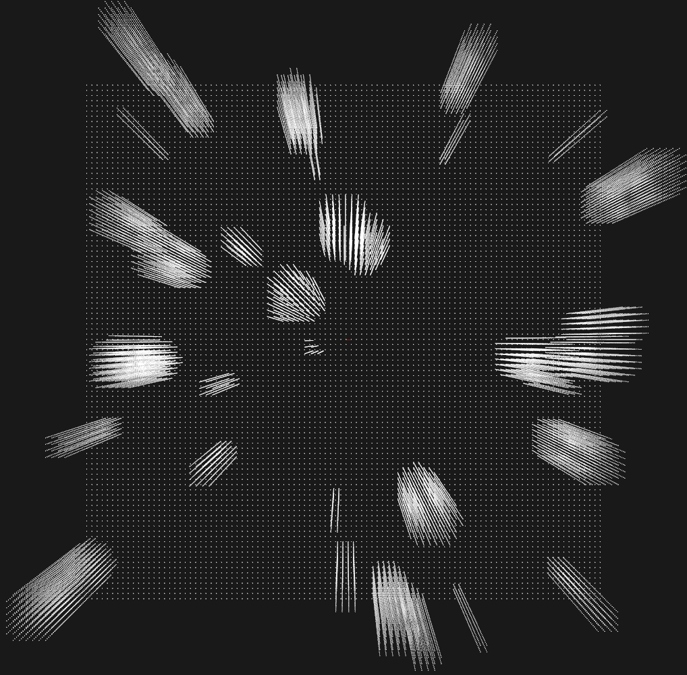
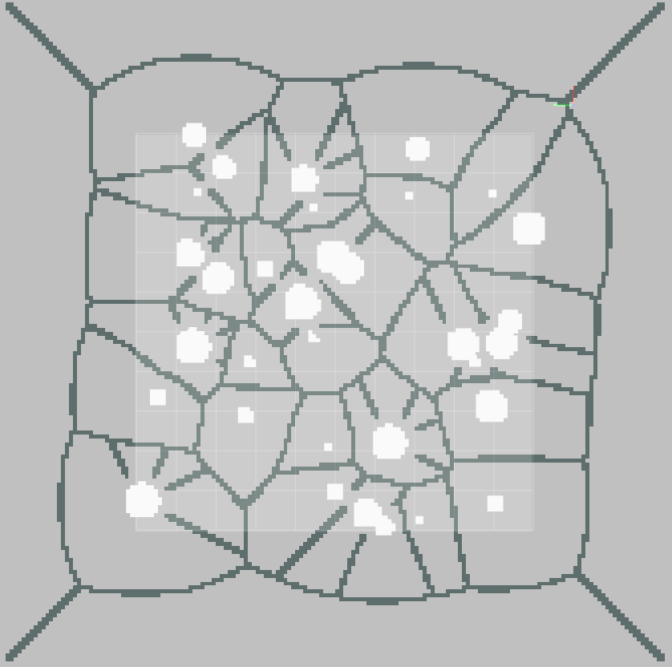
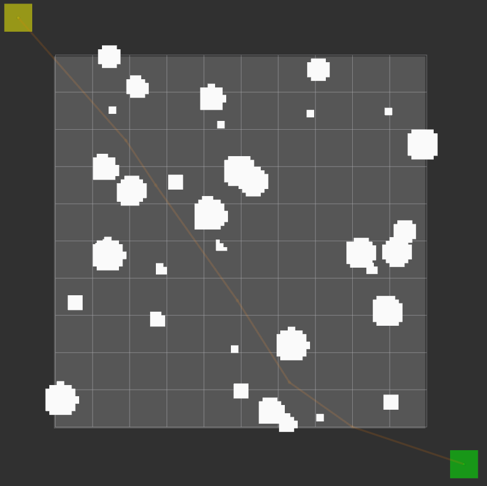
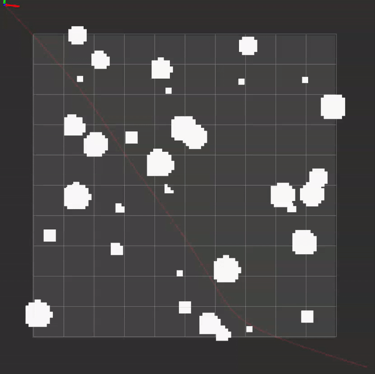

# path_planning_test_case
This repository contains test cases for path planning and trajectory optimization problems.

Currently only one 10m x 10m map `map0` with cylindrical obstacles is provided, which has the following top view:

First, a voronoi decomposition of the map is performed, yielding:

An A* planner is then executed from the yellow point [-6.0, 6.0, 1.2] to the green point [6.0, -6.0, 1.2] on the voronoi graph of the map, yielding the following raw A* path:

After processing the raw A* path using a line-of-sight check, we end up with a piecewise linear A* path:

Naively fitting a minimum jerk path to the waypoints from the piecewise linear A* path does not necessarily yield a collision free path: 

## Important Info
1. Origin of the map `(0.0, 0.0, 0.0)` is in the middle of the map and not at the corners of it. Obstacle positions and A* path points are relative to this origin. 
2. Refer to [jsondecode](https://www.mathworks.com/help/matlab/ref/jsondecode.html) library for parsing JSON files in MATLAB.

## Provided files
1. `map0.pcd`: (Not necessary) 10m x 10m point cloud map replete with obstacles.
    - The 3D obstacle map can be visualized with a point cloud viewer using this file.
2. `map0_obstacle_data.json`: JSON file containing the position and attributes of obstacles 
    - Within the `cylinders` field is an array of cylindrical obstacles. 
    - Each obtacle has the attributes `x`, `y`, `radius` and `height`. By iterating through each element in the array, a visualization of the obstacle map can be reconstructed.
    - All units in meters.
3. `map0_a_star_raw.json`: JSON file containing raw A* path 
    - Within the `a_star_path` field is an array of a_star points
        - `point` field: Contains (x,y,z) array
        - `time` field: Optional to use the time allocation given here, which assumes constant velocity between each 3D grid cell.
    - All units in meters.
4. `map0_a_star_processed.json`: JSON file containing piecewise linear A* path
    - This path has been processed from the continuous A* path to obtain a piecewise linear path using a simple line of sight check. Resulting in fewer waypoints.
    - All units in meters.
